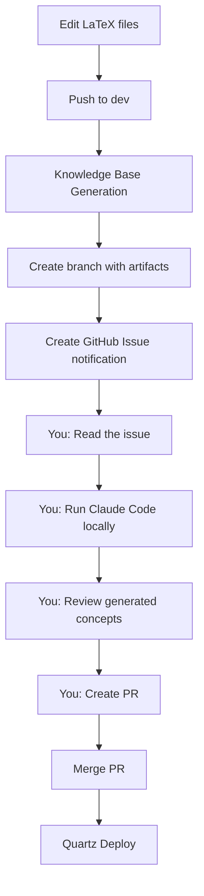
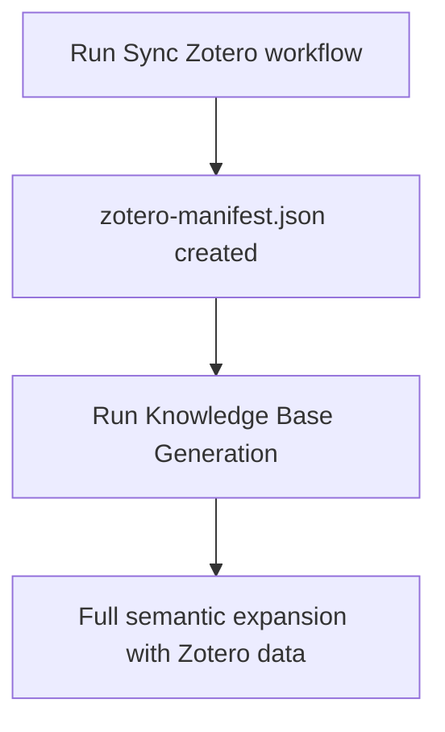

# GitHub Workflows Documentation

This directory contains automated workflows for the weird-science repository.

## 🚀 Quick Start: Master Pipeline

**NEW: Use the [Knowledge Base Pipeline](knowledge-base-pipeline.yml) to run the complete workflow!**

```bash
# Trigger via GitHub Actions UI, or wait for:
# - Weekly automatic runs (Mondays at 3 AM UTC)
# - Pushes to dev that modify .tex or .md files
```

This master workflow orchestrates the entire process from Zotero sync → Knowledge base generation → Notification.

## Workflow Overview

### 0. **Knowledge Base Pipeline (Master)** ([knowledge-base-pipeline.yml](knowledge-base-pipeline.yml)) ⭐

**Trigger:**
- Weekly schedule (Mondays at 3 AM UTC)
- Pushes to `dev` that modify `.tex` or `.md` files
- Manual dispatch with options

**Purpose:** Orchestrates the complete knowledge base generation pipeline

**What it does:**
1. ✅ Syncs Zotero library (with PDF downloads and fuzzy matching)
2. ✅ Generates knowledge base data (matches 9/16 cited papers)
3. ✅ Creates notification issue for manual Claude Code intervention
4. ✅ Provides summary of pipeline execution

**Benefits:**
- Single workflow to rule them all
- Automatic weekly updates
- Configurable steps via workflow_dispatch
- PDF support with abstract extraction
- Fuzzy matching for cited papers

### 0.1 **Knowledge Base — Automated Analysis (Experimental)** ([knowledge-base-automated.yml](knowledge-base-automated.yml)) ⚡ **NEW**

**Trigger:**
- Manual dispatch only
- Requires a generated branch from the main pipeline

**Purpose:** Fully automated semantic analysis without API calls

**What it does:**
1. ✅ Analyzes LaTeX sources using heuristics and NLP
2. ✅ Extracts concepts from cited papers automatically
3. ✅ Generates markdown concept files with Quartz compatibility
4. ✅ Creates hierarchical structure automatically
5. ✅ Opens PR with generated knowledge base
6. ✅ **No manual intervention required**

**Benefits:**
- Fully automated end-to-end
- No API calls (local processing only)
- Fast draft generation
- Good for testing and iteration
- Creates PR automatically

**Limitations:**
- Heuristic-based (not LLM-powered)
- May miss implicit concepts
- Definitions are literal extracts
- Requires manual review for quality

**Usage:**
```bash
# After main pipeline generates a branch, trigger automated analysis:
gh workflow run "Knowledge Base — Automated Analysis (Experimental)" \
  --field branch=knowledge-database/generated-19056121510
```

### 1. **Knowledge Base Generation** ([knowledge-base-generation.yml](knowledge-base-generation.yml))

**Trigger:** Pushes to `dev` branch that modify `.tex` or `.md` files, or manual dispatch

**Purpose:** Analyzes LaTeX sources and Zotero library to prepare data for semantic analysis

**Outputs:**
- `knowledge-database/analysis-data.json` - Structured data about projects, citations, and references
- `knowledge-database/claude-prompt.md` - Detailed prompt for Claude Code
- `knowledge-database/CLAUDE_INTEGRATION.md` - Integration instructions
- Creates a branch `knowledge-database/generated-<run-id>` with the artifacts

**Dependencies:**
- ⚠️ **Optional:** `zotero-cache/zotero-manifest.json` (from Zotero sync workflow)
  - If missing, workflow continues but with 0 Zotero items
  - Run "Sync Zotero Library" workflow first for full semantic expansion

### 2. **Knowledge Base — Manual Claude Code Notification** ([copilot-agent-kb.yml](copilot-agent-kb.yml))

**Trigger:** Automatically after "Knowledge Base Generation" completes, or manual dispatch

**Purpose:** Creates a GitHub issue with instructions for manual Claude Code analysis

**What it does:**
1. Verifies that `analysis-data.json` and `claude-prompt.md` exist
2. Creates a GitHub issue with:
   - Step-by-step instructions for running Claude Code locally
   - Links to the generated branch and files
   - Summary of analysis data (projects, files, citations)
   - Quick links to all relevant resources
3. Uploads artifacts for download

**Next steps (manual):**
1. Check your GitHub issues for the notification
2. Follow the instructions to run Claude Code locally
3. Claude Code will generate the knowledge base concepts
4. Commit and create a PR with the results

### 3. **Sync Zotero Library** ([sync-zotero.yml](sync-zotero.yml))

**Trigger:** Daily at 2 AM UTC, or manual dispatch

**Purpose:** Synchronizes Zotero library metadata to the repository

**Requirements:**
- `ZOTERO_API_KEY` secret (optional for public groups)
- `ZOTERO_GROUP_ID` variable (defaults to 6182921)

**Outputs:**
- Updates `zotero-cache/zotero-manifest.json`
- Updates project summary files

**Note:** Run this before Knowledge Base Generation for optimal results

### 4. **Quartz Deploy** ([quartz-deploy.yml](quartz-deploy.yml))

**Trigger:** Pushes to `dev`, or automatically after KB synthesis

**Purpose:** Builds and deploys the Quartz static site to GitHub Pages

### 5. **Build PDF** ([build-pdf.yml](build-pdf.yml))

**Trigger:** Pushes that modify `.tex` files

**Purpose:** Compiles LaTeX documents to PDF

### 6. **Build Quartz** ([build-quartz.yml](build-quartz.yml))

**Trigger:** Pushes that modify markdown or configuration files

**Purpose:** Builds the Quartz site without deploying

## Complete Workflow Pipeline

### For Knowledge Base Generation:



### Optional Zotero Integration:



## Manual Workflows

You can trigger these workflows manually from the Actions tab:

1. **Sync Zotero Library** - Updates Zotero data
2. **Knowledge Base Generation** - Prepares data for Claude analysis
3. **Knowledge Base — Manual Claude Code Notification** - Re-creates the notification issue

## Secrets & Variables Required

### Secrets
- `ZOTERO_API_KEY` (optional) - For private Zotero groups or rate limit increases

### Variables
- `ZOTERO_GROUP_ID` (optional) - Defaults to 6182921

## Troubleshooting

### "Zotero items: 0" in analysis data
- Run the "Sync Zotero Library" workflow first
- Ensure `ZOTERO_API_KEY` is set if using a private group

### No notification issue created
- Check that the Knowledge Base Generation workflow succeeded
- Verify the `issues: write` permission in the workflow file

### Claude Code can't find files
- Download the artifact from the workflow run, OR
- Checkout the generated branch: `git checkout knowledge-database/generated-<run-id>`

## Choosing Between Manual and Automated Workflows

### Use **Manual Analysis** (Knowledge Base Pipeline) when:
- ✅ You want highest quality, LLM-powered concept extraction
- ✅ You have Claude Code installed locally
- ✅ You want to iteratively refine the analysis
- ✅ Quality is more important than speed
- ✅ You need nuanced definitions and intelligent cross-referencing

### Use **Automated Analysis** (Experimental) when:
- ⚡ You need a quick draft to review
- ⚡ You want to test the pipeline without manual steps
- ⚡ You're okay with heuristic-based extraction
- ⚡ You want to iterate quickly on structure
- ⚡ You don't have immediate access to Claude Code

### Hybrid Approach (Recommended):
1. Run automated workflow to generate initial draft
2. Review what it produces
3. Run manual Claude Code analysis for refinement
4. Compare results and merge best of both

## Comparison Table

| Feature | Manual (Pipeline) | Automated (Experimental) |
|---------|------------------|--------------------------|
| **Quality** | ⭐⭐⭐⭐⭐ (LLM) | ⭐⭐⭐ (heuristic) |
| **Speed** | Slow (human required) | Fast (fully automated) |
| **API Calls** | None (local) | None (local) |
| **Concept Depth** | Deep semantic | Pattern matching |
| **Definitions** | Refined & clear | Literal extracts |
| **Cross-refs** | Intelligent | Co-occurrence based |
| **Automation** | 80% | 100% |
| **Review Needed** | Moderate | Heavy |

## Architecture Notes

**Why manual Claude Code execution?**
- Anthropic API is expensive for frequent automated runs
- Claude Code in your editor is free (with subscription)
- Manual review ensures quality control of generated content
- Flexibility to adjust prompts and iterate

**Why add automated analysis option?**
- Enables fully automated testing of the pipeline
- Provides quick drafts for structure validation
- No API costs or manual intervention required
- Good baseline to compare against manual analysis

**Why create branches for artifacts?**
- Preserves full history of generated data
- Easy to reference in notifications
- Allows parallel generation attempts
- Clean separation from main development branches
